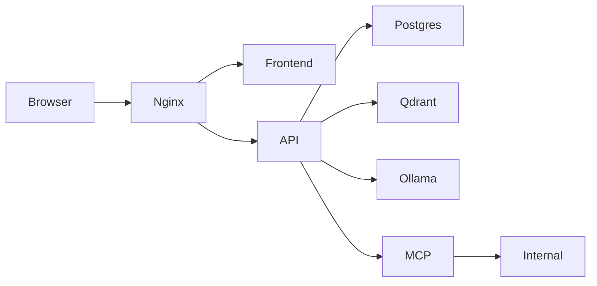

# TechDesk AI architecture

TechDesk AI is a multi-tenant, AI-powered customer-support and knowledge SaaS, deployed here as an intentionally vulnerable training lab.

The host only exposes port `8080`. PostgreSQL, Qdrant, Ollama, the internal service, and the MCP simulator are not published to the host. The internal Docker network contains synthetic data only.

## Request/auth flow

1. The browser signs in via `POST /api/auth/login` and receives a JWT access token (+ refresh token).
2. The frontend stores the token client-side and sends it as `Authorization: Bearer <token>` on every request.
3. The API's `authenticate` middleware resolves the caller onto `req.auth`. In vulnerable mode it also trusts forged JWT claims, the legacy `x-lab-user` header, and a Next.js-style `x-middleware-subrequest` bypass header.
4. Route handlers scope data by `req.auth.tenantId` and (in secure mode) enforce object- and function-level authorization.

## Trust boundaries to reason about

- **Client ↔ API:** never trust client-supplied identity, role, or tenant claims.
- **Tenant ↔ tenant:** every object lookup, search, and tool call must be tenant-scoped server-side.
- **Model ↔ policy:** retrieved/user content is untrusted data, not instructions; model output is untrusted for rendering and for downstream actions.
- **API ↔ internal services:** outbound fetches (webhooks, URL import, agent tools) must be allowlisted.

## Layout

- `artifacts/techdesk` — frontend
- `artifacts/api-server` — API (`lib/store.ts`, `lib/security.ts`, `lib/context.ts`, `routes/*`)
- `internal-service`, `mcp-server` — Docker-only fixtures
- `database/init.sql` — tenant seed
