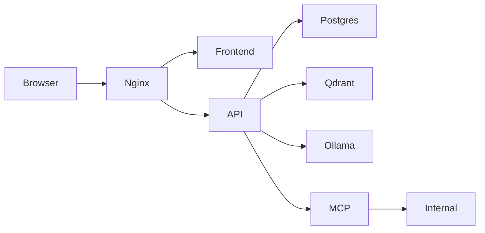

# Q-Lab architecture

Q-Lab: AI Pentest Operations is a Bond-inspired, unofficial training lab created by Ajmal Shan (0xsh4n).

The host only exposes port `8080`. PostgreSQL, Qdrant, Ollama, the internal service, and MCP are not published to the host. The internal network is Docker-internal and contains synthetic data only.